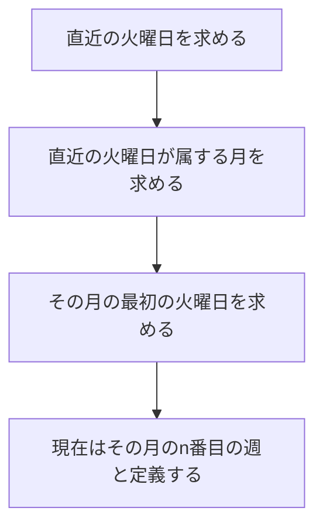

[[weekly-note|weekly note用テンプレート]]を作成した．

`YYYY-MM-n.md`形式でweekly noteを作ろう．nは今月何番目の週かを示す．
（例えば2026年4月の第三週であれば，`2026-04-3.md`を作成する）

Templaterプラグインを導入して，以下のファイルを登録する．
[[Obsidian：Canvas で今週を振り返る - Jazzと読書の日々|今週のデイリーノートのマトリックス]]をスクショして貼り付ければ，簡単に今週を振り返えれる．
[[2026-04-3|例]]を示す．

```markdown:weekly-note.md
<%*
const targetDir = "Output/WeeklyNotes"

// 直近の火曜日をもとめる.
const today = moment();
const dow = today.day(); // 0=Sun..6=Sat
const offsetToSaturday = (dow - 6 + 7) % 7;
const saturday = moment(today).subtract(offsetToSaturday, "days");
const tuesday = moment(saturday).add(3, "days");

// 直近の火曜日が属する月を求める
const ownerYear = tuesday.format("YYYY");
const ownerMonth = tuesday.format("MM");

// その月の最初の火曜日を求める
const firstOfMonth = moment(tuesday).startOf("month");
const offsetToFirstTuesday = ( 2 - firstOfMonth.day() + 7 ) % 7;
const firstTuesday = moment(firstOfMonth).add(offsetToFirstTuesday, "days");

// 現在はその月のn番目の週と定義する
const n = Math.floor(tuesday.diff(firstTuesday, "days") / 7 ) + 1;

const filename = `${ownerYear}-${ownerMonth}-${n}`;
const targetPath = `${targetDir}/${filename}.md`;

//
//  既存ファイルを確認しておく
//
const existing = app.vault.getAbstractFileByPath(targetPath);
if (existing) {
    const choice = await tp.system.suggester(
    ["上書き", "キャンセル"],
    ["overwrite", "cancel"],
    false,
    `${filename}.mdは既に存在します`
    );

    if (choice !== "overwrite") {
        // キャンセル
        await app.vault.trash(tp.config.target_file, true);
        return;
    }

    // 上書き
    await app.vault.trash(existing, true);
  }

//
//ファイルを作成
//
await tp.file.move(`${targetDir}/${filename}`);
-%>
---
ID:  <% tp.date.now("YYYYMMDDHHmm") %>
tags: [ <% tp.date.now("YYYY/MM/DD") %>, weeklyNote]
  - created/2026-04-29
---


```


## 実装の解説（蛇足）
月初や月末特殊な処理が必要．ある週は，その週の過半（4日）以上を占める月に属すると定義しよう．weekly noteは原則金曜日に書くことにして，土 ~ 金曜日の真ん中の火曜日が属する月にその週が属すると判定した方が実装しやすい．よって，Templaterは以下のように実装した．


